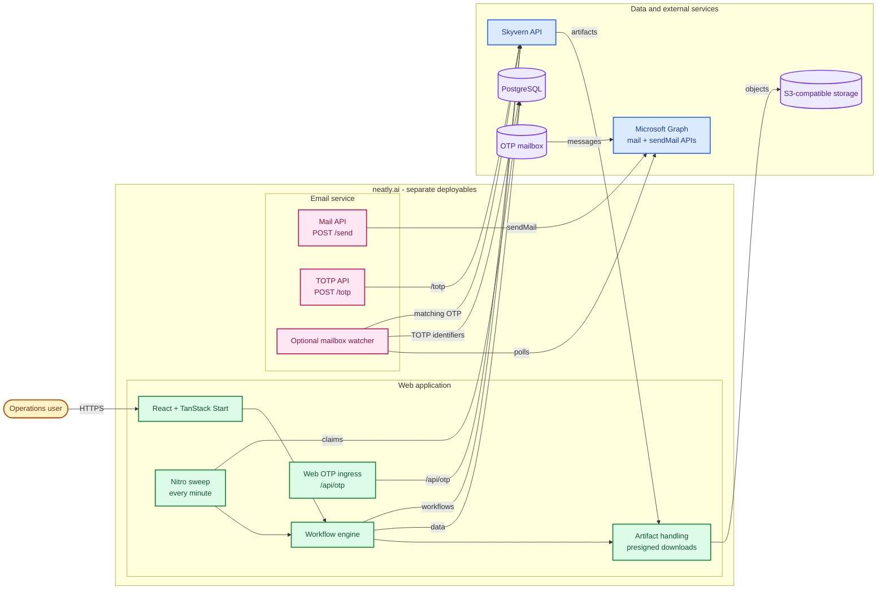

## System shape

The web application and email service are separate deployables. The web repository currently sends OTP content directly to Skyvern through its authenticated `/api/otp` ingress. The email service provides a separate authenticated `/totp` endpoint and an optional mailbox watcher for Microsoft Graph. Deployments must choose and configure the path that receives production OTP mail; the repositories do not contain an automatic web-to-email-service connection.

## Web application

The web app is a React and TanStack Start application with server functions and Nitro runtime features:

- **Routing and UI:** TanStack Router, React Query, React Form, and React Table.
- **Server boundary:** `createServerFn` handlers in `src/server`, with authentication checks in server-only modules.
- **Persistence:** Drizzle ORM over PostgreSQL. The schema stores users, carriers, carrier steps, credentials, email templates, runs, appointments, appointment steps, and timers.
- **Automation:** Nitro runs the `sweep` task every minute. The task claims up to 25 due timers and starts their workflow processing.
- **Live browser view:** the `/peek` WebSocket authenticates the session, resolves the appointment browser address, and bridges CDP traffic to Skyvern.
- **Artifacts:** Skyvern download artifacts are copied into S3-compatible storage under a run-scoped prefix. The UI receives presigned GET URLs valid for 15 minutes.

## Appointment data flow

1. An authenticated user selects a carrier and fills the workflow parameters.
2. File parameters are uploaded to Skyvern; the form submits returned presigned URLs as workflow inputs.
3. The web app creates an appointment and snapshots the carrier's ordered steps into `appointment_steps`.
4. The first step becomes active and receives a timer. The scheduler claims due timers and starts the corresponding Skyvern workflow.
5. The engine polls Skyvern until a terminal status, records the run, stores the browser session, and applies the step outcome.
6. Success advances to the next step or completes the appointment. A check can branch on success or exhaustion. Repeated failures are retried and then escalated.
7. Completed-run downloads are copied to storage and exposed through the Files dialog.

## Email service

The Go service has a single process with two independent capabilities:

- **Mail API:** `POST /send` validates a JSON message, fetches URL attachments, and sends through Microsoft Graph `sendMail`.
- **TOTP API:** `POST /totp` forwards a verification message to Skyvern's `/v1/credentials/totp` endpoint.
- **Mailbox watcher:** when `OTP_GRAPH_MAILBOX` is set, the process polls Microsoft Graph every 10 seconds by default, matches senders to TOTP identifiers from PostgreSQL, forwards matching messages with bounded concurrency, and persists a cursor plus handled message IDs.

The service obtains Microsoft Graph tokens with an OAuth 2.0 client-credentials flow. Sending and OTP reading use separate Graph credential sets so least-privilege mailbox access can be applied independently.

## State ownership

| State | Owner | Purpose |
| --- | --- | --- |
| User sessions | Web cookie + PostgreSQL user | Seven-day signed HTTP-only session cookie |
| Workflow definitions | PostgreSQL + Skyvern | Carrier metadata and ordered step references |
| Appointment progress | PostgreSQL | Steps, timers, attempts, run IDs, status, browser session |
| Secrets | Skyvern, with local metadata in PostgreSQL | Password credential ID and optional TOTP identifier |
| Downloaded files | S3-compatible storage | Run-scoped artifacts and presigned downloads |
| OTP deduplication | Email service state file | `since` cursor and up to 10,000 handled message IDs |
